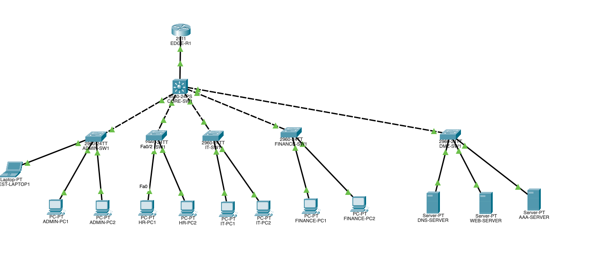
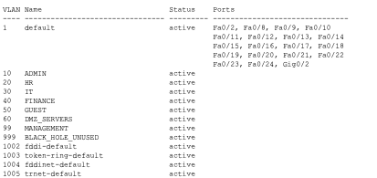
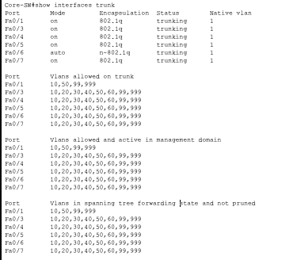
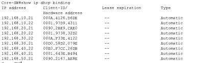

# SecureWave Enterprise Network
### Cisco Packet Tracer — Enterprise Branch Network Simulation

🌐 **[View Hosted Project Page](https://rewantth.github.io/Enterprise-Secure-Network-Packet-Tracer/)**
&nbsp;&nbsp;|&nbsp;&nbsp;
📥 **[Download .pkt File](https://rewantth.github.io/Enterprise-Secure-Network-Packet-Tracer/SecureWave_Working_Base_Final.pkt)**

---

## Overview

This project simulates a secure enterprise branch network for a fictional company called **SecureWave Solutions**, built entirely in Cisco Packet Tracer. It demonstrates the kind of network segmentation, routing, and security controls a junior network or security engineer would configure during a real branch deployment.

> All credentials used in this project are lab-only credentials for Cisco Packet Tracer simulation purposes only.

---

## What's Built

| Feature | Status |
|---|---|
| Multi-VLAN segmented network (8 VLANs) | ✅ Complete |
| Layer 3 inter-VLAN routing via SVIs | ✅ Complete |
| DHCP pools for all user VLANs | ✅ Complete |
| Trunk links between core and access switches | ✅ Complete |
| DMZ with DNS, Web, and AAA servers | ✅ Complete |
| DNS resolution — `www.securewave.local` | ✅ Complete |
| Edge Router to Core Switch routed link | ✅ Complete |
| Guest VLAN segmentation (VLAN 50) | ✅ Complete |
| Black Hole VLAN 999 for unused ports | ✅ Complete |
| Basic password hardening for lab devices | ✅ Complete |
| ACL-based inter-VLAN access control | 🔜 Planned |
| Port security | 🔜 Planned |
| OSPF between Edge Router and Core Switch | 🔜 Planned |

---

## Network Design

**Topology:** Edge Router → Layer 3 Core Switch → 5 Access Switches → End Devices

| VLAN | Name | Subnet | Gateway |
|---|---|---|---|
| 10 | ADMIN | 192.168.10.0/24 | 192.168.10.1 |
| 20 | HR | 192.168.20.0/24 | 192.168.20.1 |
| 30 | IT | 192.168.30.0/24 | 192.168.30.1 |
| 40 | FINANCE | 192.168.40.0/24 | 192.168.40.1 |
| 50 | GUEST | 192.168.50.0/24 | 192.168.50.1 |
| 60 | DMZ_SERVERS | 192.168.60.0/24 | 192.168.60.1 |
| 99 | MANAGEMENT | 192.168.99.0/24 | 192.168.99.1 |
| 999 | BLACK_HOLE | unused ports | — |

**DMZ Servers (static IPs):**
- DNS-SERVER: `192.168.60.10`
- WEB-SERVER: `192.168.60.20`
- AAA-SERVER: `192.168.60.30`

**Edge/Core routed link:**
- EDGE-R1 Gig0/0: `10.0.0.1/30`
- CORE-SW Fa0/1: `10.0.0.2/30`

---

## Screenshots

**Full Topology**

**VLAN Table — `show vlan brief`**

**Trunk Links — `show interfaces trunk`**

**DHCP Bindings — `show ip dhcp binding`**

**DNS Name Resolution — `www.securewave.local`**

---

## Key Troubleshooting Solved

- DHCP failures traced to access switch uplink ports configured as access instead of trunk — fixed using CDP to identify correct physical ports
- VLAN 60 SVI had no IP assigned — DMZ servers were unreachable until `192.168.60.1/24` was added to `interface vlan 60`
- Edge Router pings failed because the core routed IP `10.0.0.2` was configured on the wrong interface — CDP confirmed the actual connected port was `Fa0/1`

---

## Planned Security Phase (Phase 2)

- Named extended ACLs enforcing least-privilege between departments
  - HR blocked from Finance VLAN
  - Guest blocked from all internal VLANs
  - Guest permitted only to DMZ DNS/Web services
- SSH v2 restricted to IT VLAN only
- Port security with sticky MAC on access ports
- OSPF Area 0 between Edge Router and Core Switch

---

## Skills Demonstrated

| Skill | Relevant Role |
|---|---|
| VLAN segmentation and trunking | Network Engineer, CCNA roles |
| Layer 3 SVI inter-VLAN routing | Network Engineer, Infrastructure roles |
| DHCP pool design and verification | Network Administrator |
| DMZ architecture | Security Engineer, Security Architect |
| DNS and HTTP service configuration | Network/Systems Administrator |
| Troubleshooting with CDP and show commands | Network Engineer, NOC Analyst |
| Guest VLAN segmentation | Wireless/Security Engineer |
| Lab documentation and GitHub portfolio | Any technical role |

---

## Lab Credential Notice

This project uses lab-only credentials inside the Cisco Packet Tracer simulation for console, enable, and SSH-style access testing.

No real credentials are used in this project. Any credentials configured in the `.pkt` file are strictly for local simulation and should not be reused in real environments.

---

## How to Open

1. Install [Cisco Packet Tracer](https://www.netacad.com/courses/packet-tracer) (free via Cisco NetAcad)
2. Download `SecureWave_Working_Base_Final.pkt` from the link above
3. Open the file and explore the topology, CLI configs, and simulation mode
