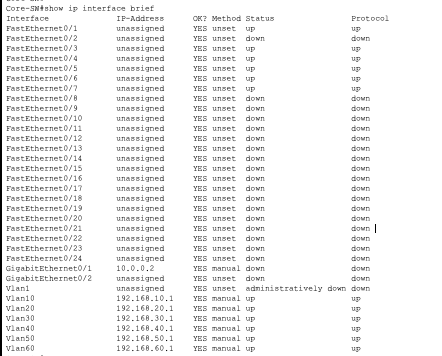
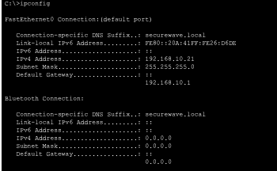
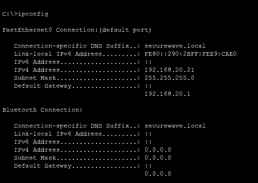
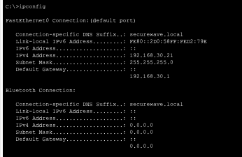
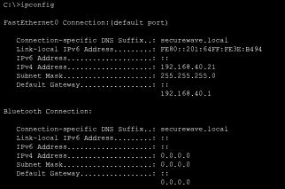
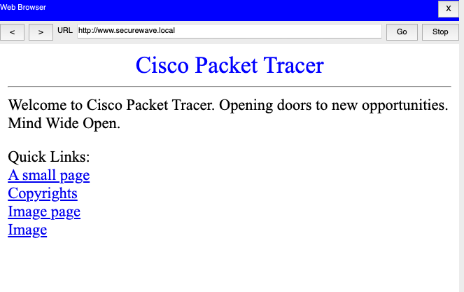

# SecureWave Enterprise Network

A Cisco Packet Tracer enterprise network simulation with VLAN segmentation, DHCP, DMZ DNS/Web services, and Edge Router connectivity.

## Download Packet Tracer Project

[Download SecureWave Packet Tracer File](../SecureWave_Working_Base_With_Edge.pkt)

> This `.pkt` file must be opened using Cisco Packet Tracer.

## Project Evidence

### Full Topology

### VLAN Verification

### Trunk Verification

### Inter-VLAN Gateway Verification

### DHCP Verification

### PC IP Configuration Proof

### Admin Gateway Ping

### Admin to DMZ Server Ping

### Web Server by DNS Name

### Core to Edge Router Ping

## GitHub Repository

[View the full GitHub repository](https://github.com/rewantth/Enterprise-Secure-Network-Packet-Tracer)